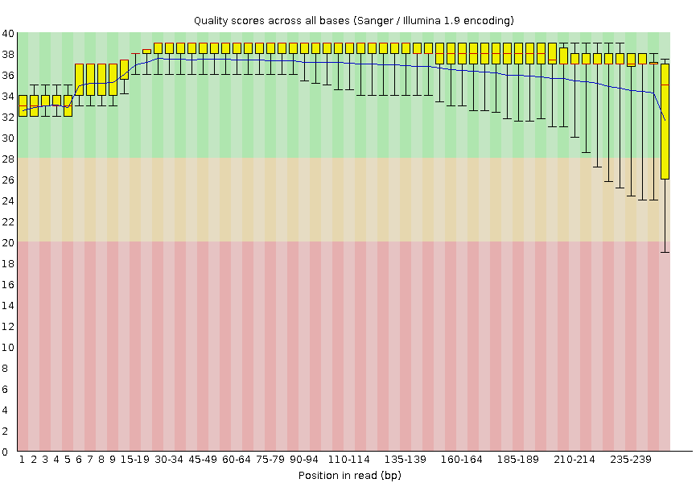
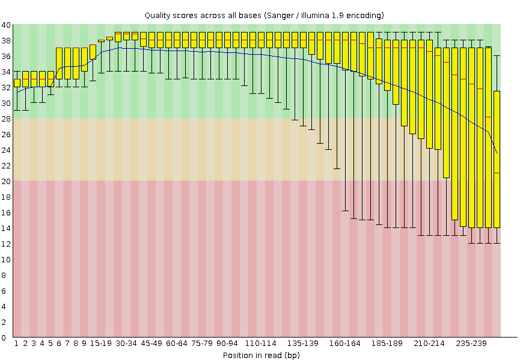
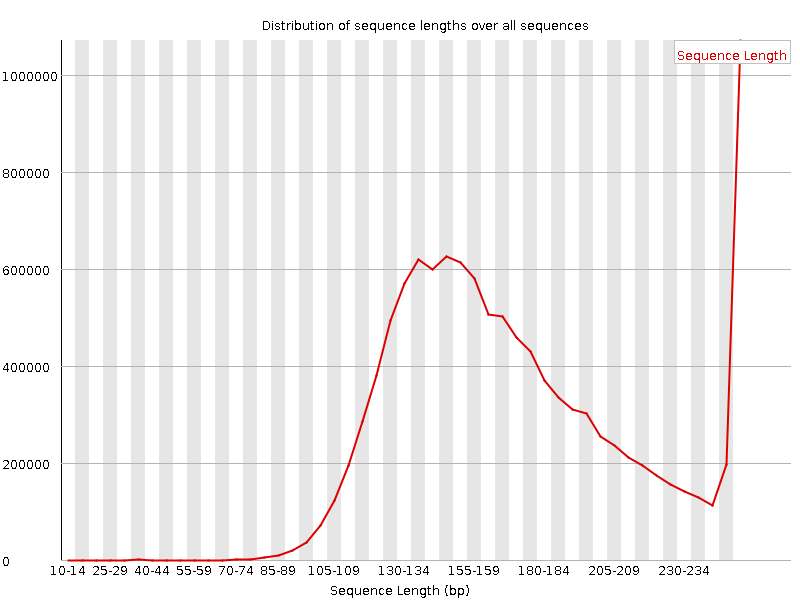
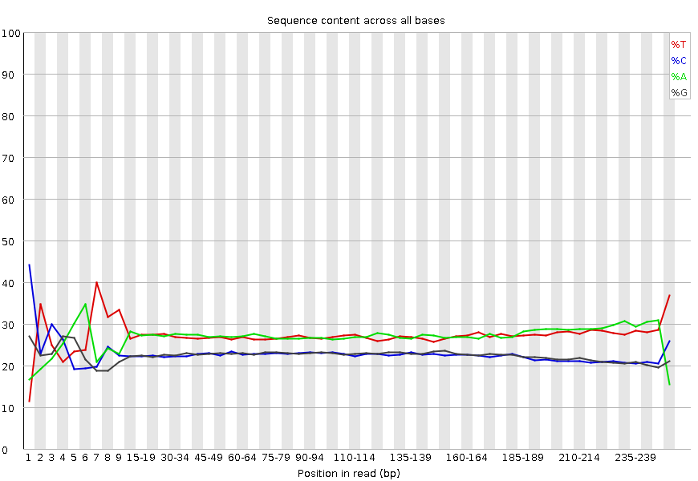
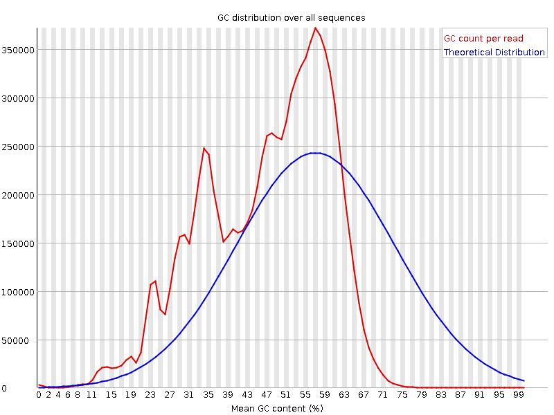
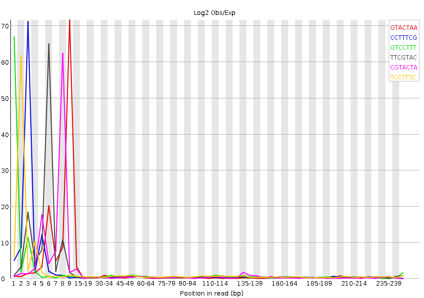

```{r, echo=FALSE}
rm(list=ls())
this.dir <- "~/Dropbox/UZH Robinson/Lectures/Statistical Analysis of High-Throughput Genomic and Transcriptomic Data/material/week05-17oct2016/assignment/"
setwd(this.dir)
```

The quality control was performed on SRR4428860, a paired-end Illumina MiSeq run on Drosophila melanogaster. It is one of nine RNA-seq to study the development of Drosophila melanogaster during space flight (PRJNA348832).




The first and the second read both show the artificially lower quality during the calibration at the beginning and a the decrease towards the end due to a worsening signal to noise ratio, which is more pronounced for the second read. In the following only the first read will be shown as the plots look similar.

That the mean of the quality distribution stays above 30 over the full 251 bases suggests some heavy trimming, which is confirmed by the length distribution.




The base sequence content shows the characteristic fluctuation at the beginning and stays more or less flat up to the divergence at the end, which is caused by the trimming. So the fastqc warning can be savely ignored.



The warning for the sequence GC content on the other hand can not be ignored, as a clear second peak in the distribution suggest some sort of contamination.



The kmer profile hints at fragments of adapters that have been missed by the trimming, because they were to short to be detected. A pairwise trimming could solve this issue. The different amount of first and second reads suggests that the trimming has been performed separately for each file.